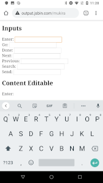
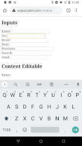
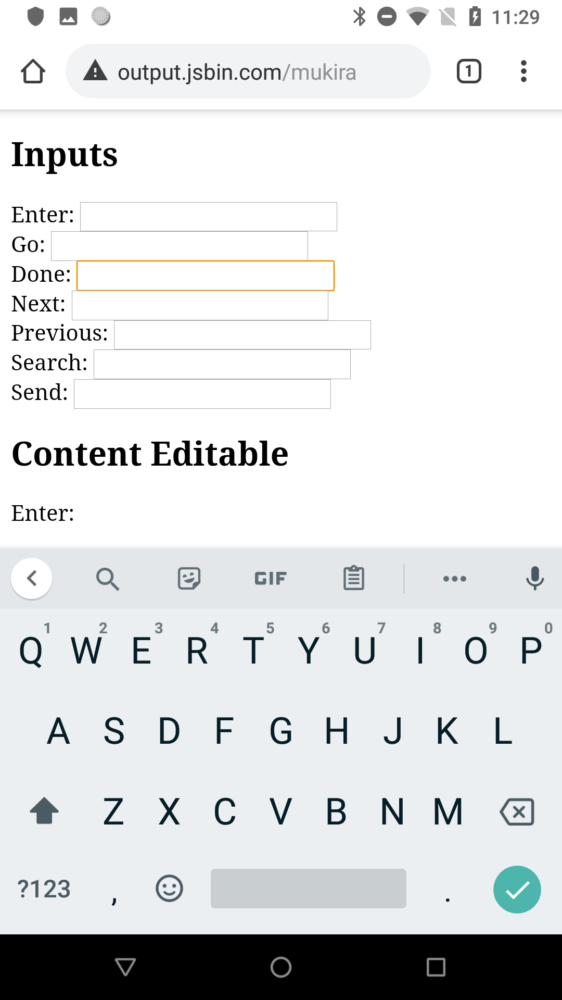
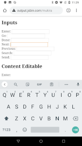
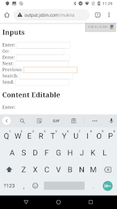
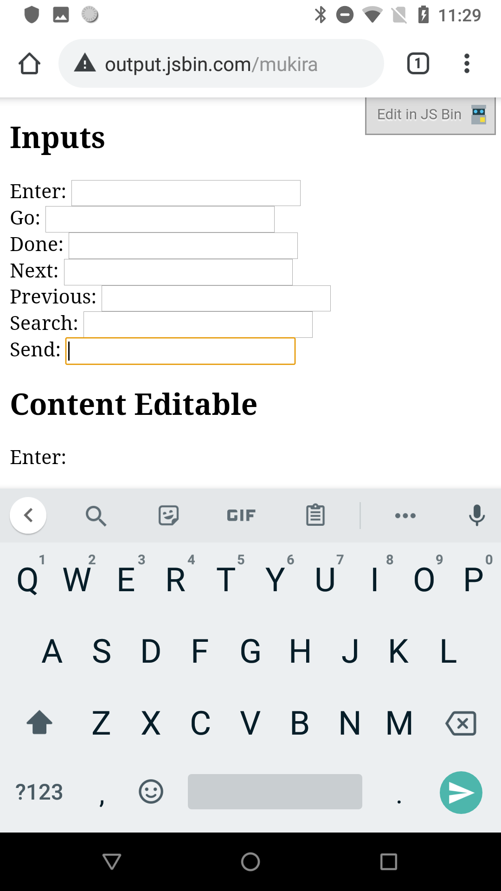

## Explainer

Mobile platforms (Android and iOS) have the ability for native applications to customize the virtual keyboard displayed to the user.
The web does not have this ability. The web has a defined set of [input modes](https://html.spec.whatwg.org/multipage/interaction.html#attr-inputmode) that
the type of keyboard will be presented. While customizing the type of keyboard is important for optimizing the user's experience, even more customization
with respect to the enter key is needed.

The enter key on a virtual keyboard represents what the user should do next, whether it is search, sending the content, inserting a new line, etc. These
types of actions are customizable from the iOS and [Android native APIs](https://developer.android.com/reference/android/view/inputmethod/EditorInfo.html#IME_ACTION_DONE).
The goal is to surface these actions to the web and allow the web application to fully control the user's experience with the virtual keyboard.

### HTML Spec

Mozilla pioneered this by first shipping the [mozactionhint](https://developer.mozilla.org/en-US/docs/Web/HTML/Element/input#Using_mozactionhint_on_Firefox_mobile) in
Firefox. To ship this in an interoperable approach Chrome standardized this in HTML spec as [enterkeyhint](https://html.spec.whatwg.org/multipage/interaction.html#attr-enterkeyhint).

### Examples

With no ability to customize the action key, the user will see this:

<input>

But with the additional keyword the developer can have a richer experience with the keyboard:

<input enterkeyhint="enter">

<input enterkeyhint="go">

<input enterkeyhint="done">

<input enterkeyhint="next">

<input enterkeyhint="previous">

<input enterkeyhint="search">

<input enterkeyhint="send">

## Considered alternatives

It was always clear that an additional attribute would be needed for this behaviour. See the [HTML Pull Request](https://github.com/whatwg/html/pull/3538)
for discussion on additional names such as "inputmode-action", "inputaction", "enterkeylabel", "returnaction", "returnkeylabel", "actionlabel", enterlabel"
and "keylabel". Through concensus of browser vendors we agreed on the "enterkeyhint" naming.
